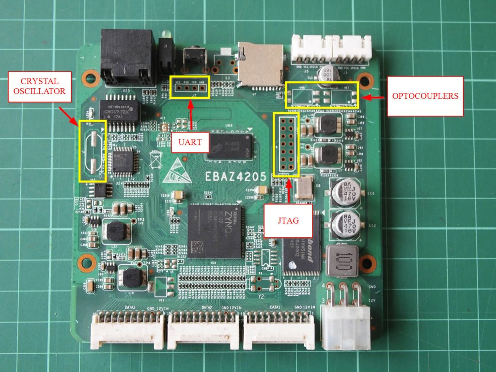
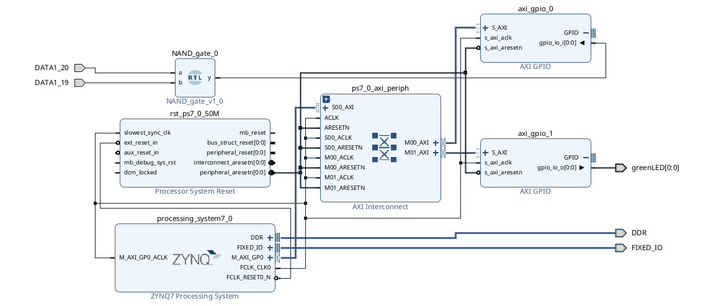

# Simple HW/SW Co-design of LED on Zynq

This repository contains a simple hardware/software co-design project demonstrating how to control an LED using the **Processing System (PS)** and **Programmable Logic (PL)** on a Xilinx Zynq SoC. This project serves as an introductory example for understanding and working with Zynq platforms.

## Description

In this project:
- The **Processing System (PS)** is used to initialize and control the LED.
- The **Programmable Logic (PL)** handles the hardware configuration for LED operation.

The implementation is based on two tutorial videos that explain step-by-step how to work with both the PS and PL on a Zynq SoC. 

### Reference Tutorials:
1. **Part 1**: [Introduction to PS and PL on Zynq](https://www.youtube.com/watch?v=_odNhKOZjEo)  
   Explains the basics of integrating the PS and PL in a Zynq SoC.
2. **Part 2**: [Controlling LEDs with HW/SW Co-design on Zynq](https://www.youtube.com/watch?v=AOy5l36DroY&t=0s)  
   Shows the practical implementation of controlling an LED using HW/SW co-design.


## Getting Started

### Prerequisites
To clone and run this project, ensure you have the following tools installed:
- **Vivado Design Suite** (for hardware design)
- **Vitis** (for software development)
- ZedBoard or Zynq-based FPGA platform

### Cloning the Repository
To clone the repository, run:
```bash
git clone https://github.com/rezaAdinepour/HW-SW-Co-Design.git

cd HW-SW-Co-Design 
```


### Steps of design

As explained in the video, the goal of this section is to design a Co-Design system. To achieve this, we design a simple NAND gate by:
1. Implementing an **AND** gate using the FPGA's logic blocks.
2. Designing a **NOT** module within the processing core (CPU).
3. Establishing the connections between these two designs.

It is important to note that for this exercise, we use the **EBAZ4205 board**, which features the **Zynq 7000 SoC**. This IC is recognized in the Vivado software under the part number `xc7z010clg400-3
`


An image of this board is provided in bellow:



You can find all of you need for this board include constrain file and evaluation board for vivado here `Ebaz Board/`


## PL Design

First, after installing the software and selecting the appropriate IC, we proceed with the design for the PL (Programmable Logic) section.

In this part, we simply design an AND gate. The code written for the AND module is as follows:

```VHDL
library IEEE;
use IEEE.STD_LOGIC_1164.ALL;


entity NAND_gate is
  Port ( a, b: in std_logic;
         y: out std_logic );
end NAND_gate;

architecture Behavioral of NAND_gate is

begin

    y <= a and b;

end Behavioral;
```

## Interconnection Design
After designing the AND module, we need to establish the interconnection between the PL (Programmable Logic) and PS (Processing System) within the chip.

To achieve this:

1. In the Vivado block design section, select the ZYNQ processor for the PS.
2. Add the custom AND module as a block in the design.
3. Use AXI GPIO blocks to enable communication between the PL and PS.

Finally, the designed system will appear as shown in the figure below.




## PS Design
After completing the design, the NOT gate must also be implemented in software (using the C programming language) and then integrated into the final synthesis.

To perform this step:

1. Open the Vitis Classic software and create a new Application Project.
2. Add the `.xsa` file generated in the previous stage to this project.
3. Once the project is created, write the code for the NOT gate as follows:

```C
#include <stdio.h>
#include "platform.h"
#include "xgpio.h"
#include "xparameters.h"
#include "xil_printf.h"

int main()
{
    init_platform();

    XGpio input, output;
    int a;
    int y;

    XGpio_Initialize(&input, XPAR_AXI_GPIO_0_DEVICE_ID);
    XGpio_Initialize(&output, XPAR_AXI_GPIO_1_DEVICE_ID);

    XGpio_SetDataDirection(&input, 1, 1);
    XGpio_SetDataDirection(&output, 1, 0);

    print("debug the code");

    while(1)
    {
    	a = XGpio_DiscreteRead(&input, 1);

    	if(a == 1)
    	{
    		y = 0;
    	}
    	else
    	{
    		y = 1;
    	}

    	XGpio_DiscreteWrite(&output, 1, y);
    }

    cleanup_platform();
    return 0;
}
```

After integrating the design, the next step is to generate the Bitstream file and program it onto the PL (Programmable Logic) section of the FPGA. Once the bitstream file is created, program the board to finalize the implementation.
